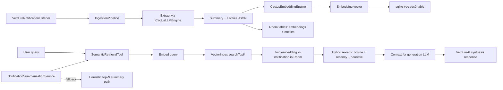

# Ambient AI Architecture v2

## Flow Diagram

## Component Mapping

| Diagram Box | Implementation |
|---|---|
| Ingestion orchestrator | `app/src/main/java/com/verdure/services/IngestionPipeline.kt` |
| Extraction (summary + entities JSON) | `IngestionPipeline.extractSummaryAndEntities()` using `CactusLLMEngine` |
| Embedding model engine | `app/src/main/java/com/verdure/core/CactusEmbeddingEngine.kt` |
| Structured store (notifications) | `StoredNotification`, `NotificationDao`, `NotificationRepository` |
| Structured store (embedding metadata) | `EmbeddingEntity`, `EmbeddingDao` |
| Structured store (entities) | `EntityMentionEntity`, `EntityMentionDao` |
| Semantic store (vectors) | `VectorIndex` + sqlite-vec `vec0` table |
| sqlite-vec extension loading | `SQLiteVecLoader` + `NotificationDatabase` (`BundledSQLiteDriver.addExtension`) |
| Retrieval tool | `app/src/main/java/com/verdure/tools/SemanticRetrievalTool.kt` |
| Router stub | `app/src/main/java/com/verdure/core/HybridRouter.kt` |
| AI orchestration callsite | `VerdureAI.handleNotificationQuery()` |
| Widget summary semantic path | `NotificationSummarizationService.summarizeWithSemanticRetrievalIfAvailable()` |

## Ranking Weights (current defaults)

`SemanticRetrievalTool` re-ranking:

- cosine similarity: **0.5**
- recency decay: **0.3**
- heuristic score (`NotificationFilter`): **0.2**

These are tunable constants in `SemanticRetrievalTool.kt`.

## Known Limitations

1. **Cactus embedding model availability**
   - Cactus 1.4.3-beta registry currently exposes embedding slugs like `qwen3-0.6-embed` and `nomic2-embed-300m`.
   - MiniLM slugs (`minilm`, `all-minilm-l6-v2`) were not available in the verified registry.

2. **sqlite-vec Android indexing mode**
   - Current setup uses `vec0` flat KNN with cosine distance.
   - HNSW was not enabled in this packaged sqlite-vec build and is marked as TODO.

3. **Dual resident model memory on Pixel 8A**
   - Code now keeps generation and embedding models as separate resident `CactusLM` instances.
   - Actual memory/headroom behavior must be verified on-device under realistic workload.

